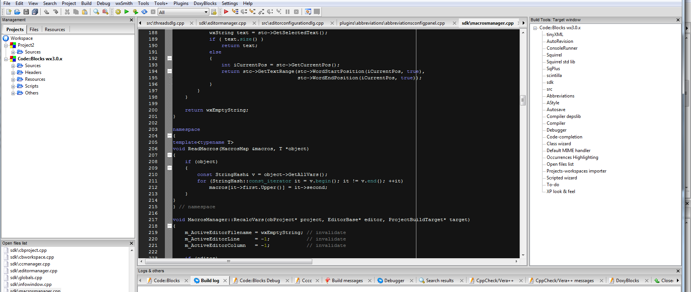

Table of Contents
=================

   * [cbBuildTools](#cbbuildtools)
      * [Screen shots](#screen-shots)
      * [Getting Started](#getting-started)
      * [Using the plugin](#using-the-plugin)
        * [target window](#target-window)
      * [Contributing](#contributing)
      * [Changelog](#changelog)
      * [Authors](#authors)
      * [License](#license)
      * [Acknowledgments](#acknowledgments)


# cbbuildtools

Build tools plugin for [Code::Blocks IDE](http://www.codeblocks.org/). 

This plugin extends the build UI for Codeblocks. At the moment it adds following controls:
- [x] ["Target window"](#target-window).
- [ ] ["Selective compiling"](#Selective-compiling).

## Screen shots



## Getting Started

At the moment there are no binary builds available for this plugin so you have to build it by yourself.

### Prerequisites

A installed and running wxWidgets library with version 2.8.X or 3.X.X (you need this also for building Code::Blocks)

To get the code for this plugin you can clone the git repo or download the code as zip archive.

The folder structure is as following:
* Code::Blocks source code cloned to 
```
/home/test/programming/codeblocks_source/
```
In this folder there should be a folder called *src*, *m4* and *debian*. The Code::Blocks source code should be found under *src*
* cbSystemView source code:
```
/home/test/programming/cbSystemView_source/
```
In this folder you find the .cbp files of the plugin and this README.md file

### Installing

0. Build a Code::Blocks version with wxWidgets version 3.X.X

1. To build the plugin simply open the project file corresponding for your operating system:
 * windows: cbBuildTools.cbp
 * linux: cbBuildTools_unix.cbp
 * mac: Sorry, i don't have a mac to provide any project file... Help is welcome...
2. Configure the *cb* global variable to point to the *src* folder of your codeblocks repository
```
/home/test/programming/codeblocks_source/src
```
You can configure the global variable under:
  * Settings->Global variables
  * Select cb on the left list
  * Set the path in the *base* field

3. select the *cb_plugin_wx28* or *cb_plugin_wx30* target from the drop down menu near the build button
4. Hit the build button
5. Fix errors (there should not be any errors ;) )
6. Open your productive codeblocks program
7. Plugins->Manage plugins->Install new
8. Browse to 
```
/home/test/programming/cbSystemView_source/plugin_wx30
```
and select the plugin to install.

  **!!NOTE**: The plugin can only run in a Code::Blocks version compiled with the same compiler and the same wxWidgets version.


## Using the plugin

## target window
This control allows a shortcut to building targets. 
To activate the view call the menu entry "View"->"Build tools"->"Target window"

A double click on the target name in the "Target window" builds the target.
Right->Click on the targets shows a context menu with
* "Build"
* "Clean"
* "Rebuild"

## Selective compiling
TODO, for a preview: https://github.com/bluehazzard/cbSelectiveCompiling

## Contributing

Any bug report, new idea, patch, pull requests are welcome.

## Changelog

No actual release

## Authors

* **bluehazzard** - *Initial work*


## License

This project is licensed under the GPL v3 License - see the [LICENSE.md](LICENSE) file for details

## Acknowledgments

The whole Code::Blocks team

